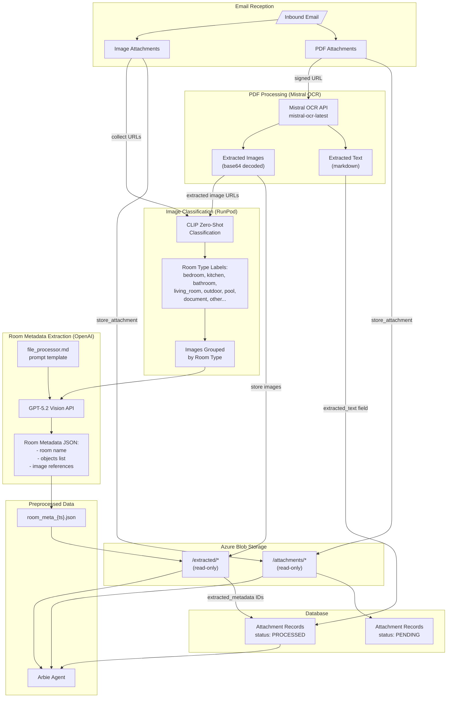
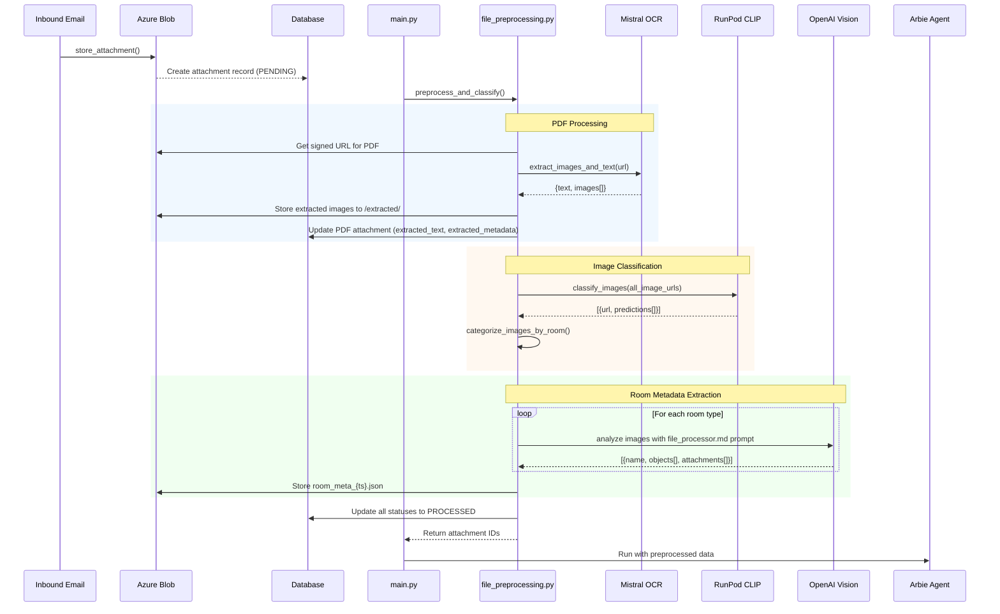
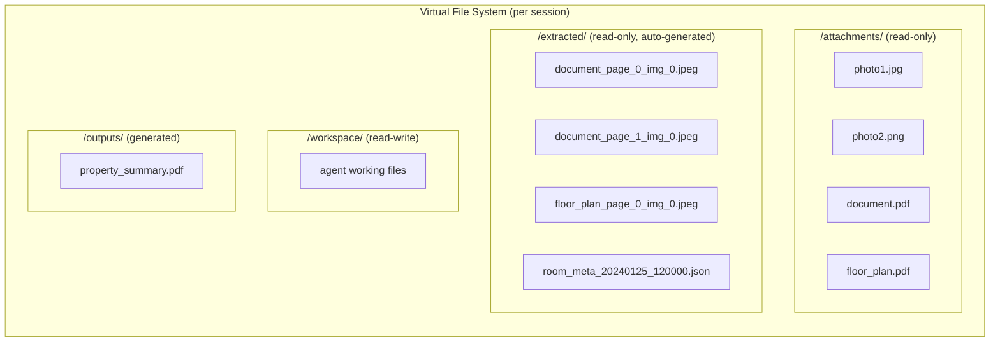
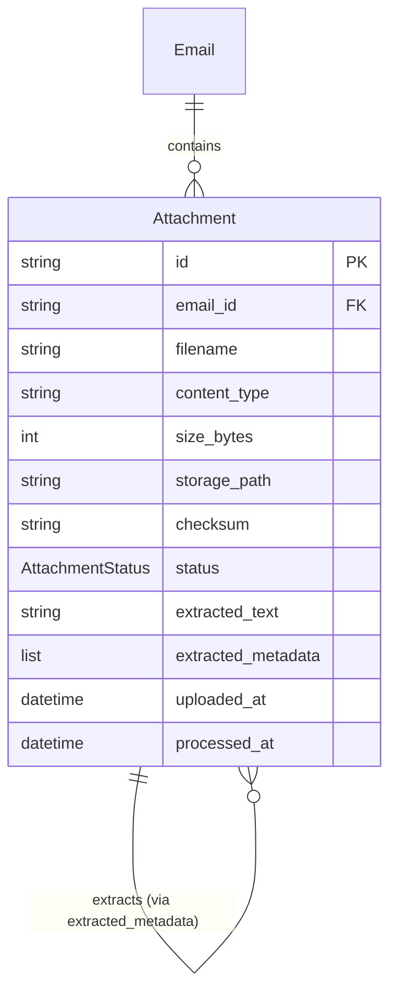

# Attachment Preprocessing Pipeline

Technical overview of how PDF and image attachments are preprocessed before the Arbie agent runs.

## Pipeline Overview



## Detailed Step Sequence



## Virtual File System After Preprocessing



## Data Model



## External Services

| Service | Purpose | API |
|---------|---------|-----|
| **Mistral OCR** | PDF text & image extraction | `mistral-ocr-latest` model |
| **RunPod** | CLIP zero-shot image classification | Serverless endpoint |
| **OpenAI Vision** | Room clustering & object detection | `gpt-5.2` with vision |
| **Azure Blob** | File storage | Blob Storage SDK |

## CLIP Classification Labels

The RunPod endpoint uses these labels for zero-shot classification:

```
bedroom, kitchen, living_room, bathroom, outdoor, pool,
dining_room, balcony, terrace, garage, garden, document, other
```

Each label is prefixed with "a photo of a " (e.g., "a photo of a bedroom") for CLIP compatibility.
